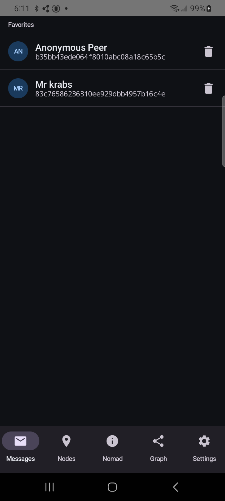
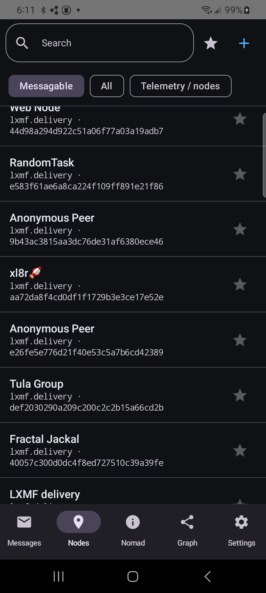
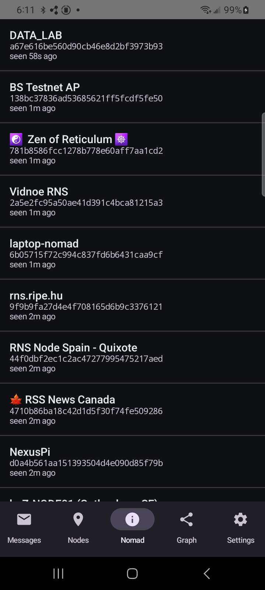
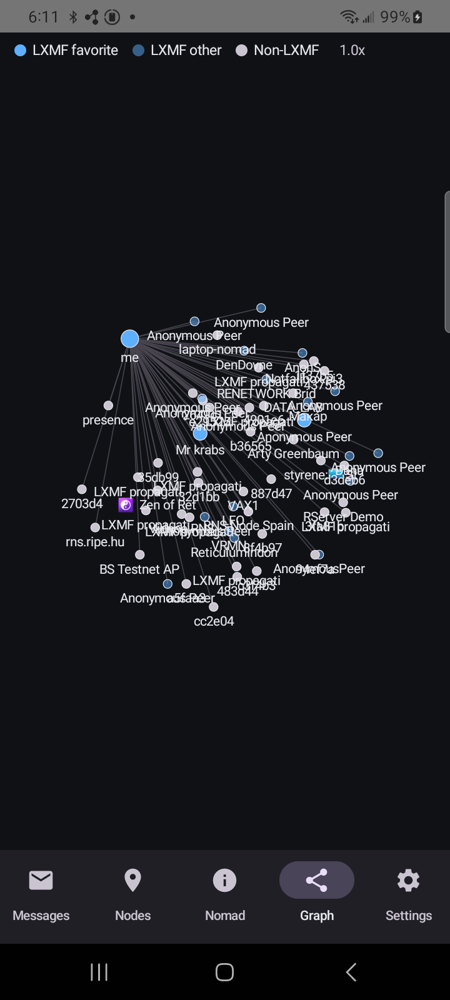
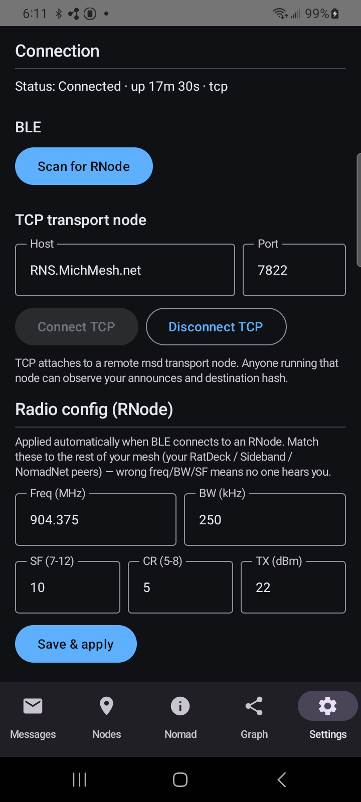

# Reticulum Mobile App

Native Android (Kotlin Multiplatform) client for the [Reticulum](https://reticulum.network/) LoRa mesh network. Replaces the [browser-based webclient](../reticulum-lora-webclient/) with a real native app that runs a foreground service for persistent BLE/TCP connections, fires system notifications on incoming LXMF messages, and ships as a signed APK.

## Status

**Alpha — signed APKs ship from CI on every `android-vX.Y.Z` tag.** Latest: [`android-v0.1.10`](https://github.com/thatSFguy/reticulum-mobile-app/releases/tag/android-v0.1.10).

Works end-to-end against a known-good Reticulum mesh:

- Connects to an RNode over BLE (with a Scan-for-RNode picker, no manual MAC entry needed)
- Pushes LoRa radio config (freq / BW / SF / CR / TX power) to the RNode on connect
- Connects to a remote rnsd `TCPServerInterface` (e.g. `RNS.MichMesh.net:7822`)
- Receives announces, parses them, populates a unified Destinations table
- Renders a force-directed Graph view of every observed destination
- Renders NomadNet micron pages (parser + Compose renderer; demo content verified)
- Generates a per-install Reticulum identity, persists it in Room
- Shares it via a QR code on the Settings tab; scans others' QR codes from the Nodes tab
- Sends/receives opportunistic LXMF messages (encrypted; retry queue mirrors the webclient's MSG_BACKOFF_MS)
- Foreground service keeps the connection alive when the Activity is gone, fires high-priority notifications on inbound messages

### Known issue

**Outbound announces are not propagating to other clients on the MichMesh TCP transport.** Inbound packets work (we see other peers' announces fine) but other clients (Sideband, MeshChatX) don't see ours. The wire bytes match Python RNS test vectors byte-for-byte; current investigation suggests the issue is server-side filtering (`OUT = false` default on `TCPServerInterface`) or a TCP-specific routing convention we haven't replicated. Diagnostics in the app surface the failure mode (LRPROOF timeouts on every NomadNet fetch attempt). See `CLAUDE.md` for the running diagnostic notes.

This issue is the headline blocker before the project moves out of alpha.

## Screenshots

Live against the MichMesh TCP transport node (`RNS.MichMesh.net:7822`) on a Galaxy A42 5G running v0.1.32.

| Messages | Nodes | Nomad | Graph | Settings |
|---|---|---|---|---|
|  |  |  |  |  |

- **Messages** — favorited destinations; tap a row to open the conversation. Star a node from the Nodes tab to bring it here.
- **Nodes** — every observed `lxmf.delivery` destination with filter chips (Messagable / All / Telemetry / Favorites), search, manual hash entry, and QR scanner.
- **Nomad** — `nomadnetwork.node` destinations. Tap → fetches `:/page/index.mu` over a Reticulum Link and renders the micron content.
- **Graph** — Compose Canvas force-directed view of every observed destination (LXMF favorite / LXMF other / Non-LXMF). Pinch to zoom, drag to reposition.
- **Settings** — connection status + uptime, BLE scanner, TCP host:port, radio config (freq / BW / SF / CR / TX), identity (display name + QR), diagnostics log.

## Install

Sideload the latest signed APK:

```powershell
# Download from the releases page
gh release download android-v0.1.10 --repo thatSFguy/reticulum-mobile-app
adb install androidApp-release.apk
```

Or browse releases at https://github.com/thatSFguy/reticulum-mobile-app/releases and tap the `.apk` from the phone.

## What's here

| Path | Description |
|------|-------------|
| `androidApp/` | Android application: Compose UI, foreground service, Room storage, BLE transport |
| `androidApp/branding/` | Source SVG + 1024px PNG of the launcher icon (regenerable mipmaps under `res/`) |
| `shared/commonMain/` | KMP shared module: protocol, crypto interfaces, announce/LXMF/Link, telemetry parser, NomadNet micron parser |
| `shared/androidMain/` | Android crypto provider (Bouncy Castle), BLE NUS transport, TCP socket actual |
| `shared/iosMain/` | iOS scaffold (commented out — future) |
| `reference/` | JS source files from the webclient, protocol notes, test vectors |
| `.github/workflows/` | `android-ci.yml` builds debug APK on every push; `android-release.yml` builds signed AAB+APK on tag |
| `CLAUDE.md` | Project guide: architecture, protocol reference, known bugs, running diagnostics |

## Architecture

```
shared/commonMain/     ← Protocol logic (platform-independent)
  ├── protocol/        Packet header encode/decode, constants
  ├── crypto/          Identity, TokenCrypto, CryptoProvider interface
  ├── codec/           Minimal MessagePack encoder/decoder
  ├── announce/        Build/parse/validate announces, known destinations, telemetry parser
  ├── lxmf/            LXMF message pack/unpack with dual-variant signature verify
  ├── link/            Reticulum Link protocol (responder + initiator state machines)
  ├── nomad/           Micron parser for NomadNet pages
  ├── engine/          ReticulumEngine glue: routes packets, manages link sessions
  ├── transport/       KISS + HDLC frame encode/decode, Transport interface, TcpInterface
  └── store/           Data models + repository interfaces (single Destinations table)

shared/androidMain/    ← Android-specific
  └── platform/        AndroidCryptoProvider (Bouncy Castle / JCA), BleTransport (NUS), RadioConfig

androidApp/            ← Android UI + lifecycle
  ├── ui/screens/      Messages, Nodes, Nomad, Graph, Settings (5 bottom-nav tabs)
  ├── ui/graph/        Force-directed layout for the Graph tab
  ├── service/         ReticulumService: foreground service + reconnect supervisor
  ├── storage/         Room database + Repositories implementing the commonMain interfaces
  ├── platform/        BLE permission helper, BLE scanner, QR code generator
  └── MainActivity.kt  Entry point + nav host
```

## Tabs

- **Messages** — favorited destinations with a conversation view; star a destination on Nodes to bring it here.
- **Nodes** — every observed destination with filter chips (Messagable / All / Telemetry / Favorites). Manual hash entry + QR scanner. "Last seen" age + stale warning for destinations that haven't announced in 30 min.
- **Nomad** — listing of `nomadnetwork.node` destinations. Tap → "Load page" fetches `:/page/index.mu` over a Reticulum Link and renders the micron content (single-packet pages only for now).
- **Graph** — Compose Canvas force-directed view of all destinations; pinch zoom, two-finger pan, drag-to-reposition.
- **Settings** — connection (BLE scanner / TCP host:port), radio config (freq/BW/SF/CR/TX power), identity (display name editor, QR code, reset), diagnostics log with copy/clear.

## Build

CI handles releases. To build locally:

```bash
# Install JDK 17 (e.g. Microsoft.OpenJDK.17 via winget on Windows)
gradle wrapper --gradle-version 8.7   # one-time wrapper bootstrap
./gradlew :androidApp:assembleDebug
```

Output APK lands at `androidApp/build/outputs/apk/debug/`.

For signed releases, set the four `ANDROID_KEYSTORE_*` GitHub Actions secrets (or env vars locally) and tag `android-vX.Y.Z`.

## Related

- [reticulum-lora-webclient](../reticulum-lora-webclient/) — the Capacitor-based browser client this replaces
- [reticulum-rnode](../reticulum-rnode/) — RNode firmware (the LoRa modem)
- [reticulum-lora-repeater](../reticulum-lora-repeater/) — repeater firmware
- [markqvist/Reticulum](https://github.com/markqvist/Reticulum) — upstream Python RNS
- [torlando-tech/columba](https://github.com/torlando-tech/columba) — another native Android Reticulum client (independent codebase, same target)
- [liamcottle/reticulum-meshchat](https://github.com/liamcottle/reticulum-meshchat) — Reticulum chat with Android builds
